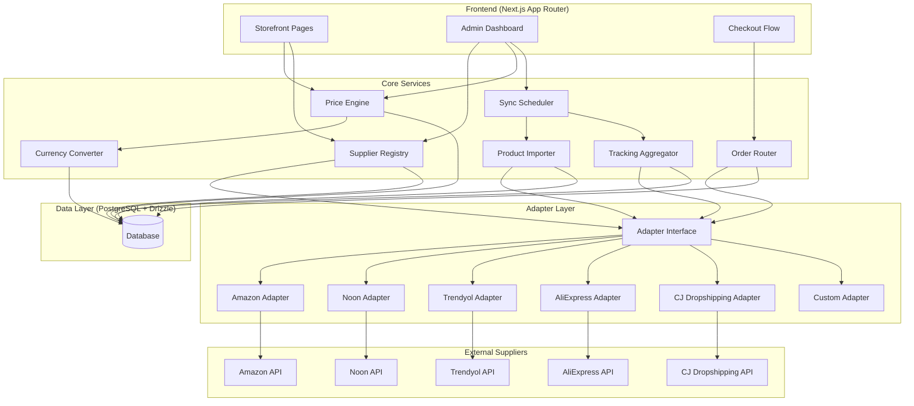
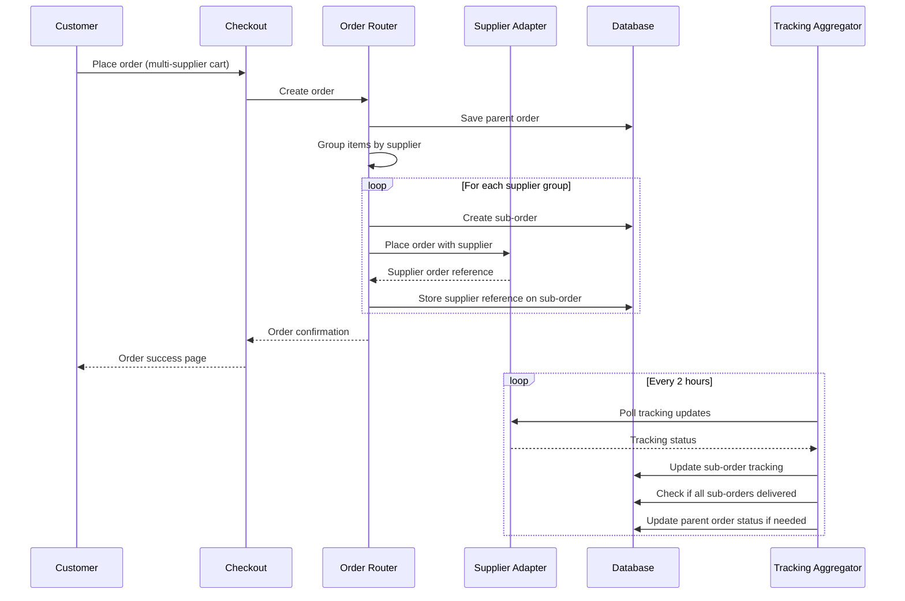
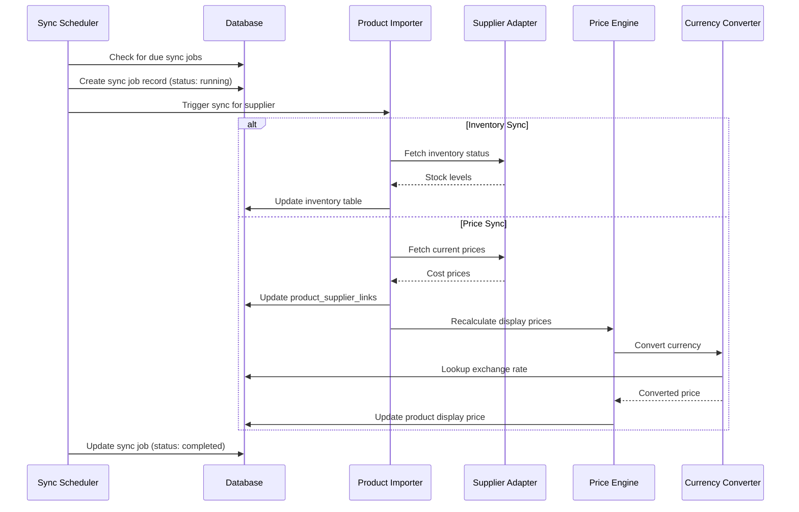
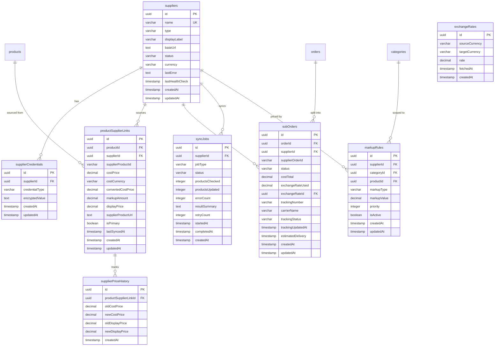

# Design Document: Multi-Supplier Dropshipping

## Overview

This design transforms Zivara from a single-store eCommerce platform into a multi-supplier dropshipping aggregator. The system introduces a supplier abstraction layer that connects to external product sources (Amazon, Noon, Trendyol, AliExpress, CJ Dropshipping, custom), imports their catalogs, synchronizes pricing and inventory, routes orders to the correct supplier, and aggregates shipment tracking — all while preserving the existing storefront experience.

The architecture follows a registry + adapter pattern for supplier integrations, a rule-based price engine for markup management, and a scheduler-driven sync pipeline for keeping data current. The existing `products`, `orders`, and `inventory` tables remain unchanged; new tables and linking records extend the data model without breaking existing functionality.

### Key Design Decisions

1. **Adapter Pattern over Direct Integration**: Each supplier gets its own adapter implementing a common interface. This isolates supplier-specific logic and makes adding new suppliers a single-module task.
2. **Linking Tables over Schema Modification**: Rather than adding supplier columns to the existing `products` table, a `productSupplierLinks` join table connects products to suppliers. This preserves backward compatibility.
3. **Sub-Order Model**: Customer orders are split into sub-orders per supplier at checkout time. The parent order remains the customer-facing entity; sub-orders are internal fulfillment records.
4. **Server-Side Encryption for Credentials**: AES-256-GCM encryption for supplier API keys, with decryption only at runtime when the adapter needs authentication.
5. **Configurable Sync Intervals**: Inventory and price sync run on configurable cron-like schedules via the Sync Scheduler, with retry and exponential backoff.

## Architecture

### System Architecture Diagram



### Order Flow Diagram



### Sync Pipeline Diagram



## Components and Interfaces

### 1. Supplier Adapter Interface

The core abstraction for all supplier integrations. Each supplier type implements this interface.

```typescript
// src/features/suppliers/adapters/types.ts

export type SupplierType = 'amazon' | 'noon' | 'trendyol' | 'aliexpress' | 'cj_dropshipping' | 'custom';

export interface AdapterResponse<T> {
  success: boolean;
  data: T | null;
  error?: {
    code: string;
    message: string;
    retryable: boolean;
  };
}

export interface SupplierProduct {
  supplierProductId: string;
  name: string;
  description: string;
  price: number;
  currency: string;
  images: { url: string; alt?: string }[];
  category?: string;
  inStock: boolean;
  stockQuantity?: number;
  productUrl: string;
}

export interface SupplierOrderRequest {
  supplierProductId: string;
  quantity: number;
  shippingAddress: {
    line1: string;
    line2?: string;
    city: string;
    state: string;
    postalCode: string;
    country: string;
  };
}

export interface SupplierOrderResult {
  supplierOrderId: string;
  estimatedDeliveryDate?: Date;
  trackingNumber?: string;
  carrierName?: string;
}

export interface TrackingInfo {
  trackingNumber: string;
  carrierName: string;
  status: 'pending' | 'in_transit' | 'out_for_delivery' | 'delivered' | 'exception';
  statusTimestamp: Date;
  events: {
    status: string;
    description: string;
    timestamp: Date;
    location?: string;
  }[];
}

export interface SupplierAdapter {
  readonly type: SupplierType;

  healthCheck(credentials: DecryptedCredential[]): Promise<AdapterResponse<{ healthy: boolean }>>;

  fetchProducts(
    credentials: DecryptedCredential[],
    options: { page?: number; limit?: number; query?: string }
  ): Promise<AdapterResponse<{ products: SupplierProduct[]; hasMore: boolean }>>;

  fetchProductDetails(
    credentials: DecryptedCredential[],
    supplierProductId: string
  ): Promise<AdapterResponse<SupplierProduct>>;

  checkInventory(
    credentials: DecryptedCredential[],
    supplierProductIds: string[]
  ): Promise<AdapterResponse<{ productId: string; inStock: boolean; quantity?: number }[]>>;

  placeOrder(
    credentials: DecryptedCredential[],
    orders: SupplierOrderRequest[]
  ): Promise<AdapterResponse<SupplierOrderResult>>;

  getTrackingInfo(
    credentials: DecryptedCredential[],
    supplierOrderId: string
  ): Promise<AdapterResponse<TrackingInfo>>;
}

export interface DecryptedCredential {
  type: 'api_key' | 'oauth_token' | 'affiliate_id';
  value: string;
}
```

### 2. Supplier Registry

Manages supplier registration, adapter resolution, and health monitoring.

```typescript
// src/features/suppliers/registry.ts

export class SupplierRegistry {
  private adapters: Map<SupplierType, SupplierAdapter>;

  constructor() {
    this.adapters = new Map();
  }

  register(adapter: SupplierAdapter): void;
  getAdapter(type: SupplierType): SupplierAdapter | undefined;
  hasAdapter(type: SupplierType): boolean;

  async verifyConnectivity(
    supplierId: string
  ): Promise<{ healthy: boolean; error?: string }>;
}
```

### 3. Product Importer

Handles fetching products from suppliers and creating/updating local records.

```typescript
// src/features/suppliers/importer.ts

export interface ImportResult {
  supplierId: string;
  totalFetched: number;
  created: number;
  updated: number;
  skipped: number;
  errors: { supplierProductId: string; error: string }[];
}

export async function importProducts(
  supplierId: string,
  options?: { page?: number; limit?: number; query?: string }
): Promise<ImportResult>;

export async function syncInventory(supplierId: string): Promise<SyncResult>;
export async function syncPrices(supplierId: string): Promise<SyncResult>;
```

### 4. Price Engine

Calculates display prices by applying markup rules and currency conversion.

```typescript
// src/features/suppliers/price-engine.ts

export interface MarkupCalculation {
  costPrice: number;
  costCurrency: string;
  convertedCostPrice: number;
  markupType: 'percentage' | 'fixed';
  markupValue: number;
  markupAmount: number;
  displayPrice: number;
  ruleId: string | null; // null = default 20% rule
}

export async function calculateDisplayPrice(
  productId: string,
  supplierId: string,
  costPrice: number,
  costCurrency: string
): Promise<MarkupCalculation>;

export async function recalculateAllPrices(
  scope: { supplierId?: string; categoryId?: string; productId?: string }
): Promise<{ updated: number; errors: number }>;

export function resolveMarkupRule(
  rules: MarkupRule[],
  productId: string,
  categoryId: string,
  supplierId: string
): MarkupRule | null;
```

### 5. Currency Converter

Converts prices between currencies using stored exchange rates.

```typescript
// src/features/suppliers/currency.ts

export function convert(
  amount: number,
  fromCurrency: string,
  toCurrency: string,
  rate: number
): number;

export async function getExchangeRate(
  fromCurrency: string,
  toCurrency: string
): Promise<{ rate: number; isStale: boolean; updatedAt: Date }>;

export async function refreshExchangeRates(): Promise<void>;
```

### 6. Order Router

Splits customer orders into sub-orders by supplier and dispatches them.

```typescript
// src/features/suppliers/order-router.ts

export interface SubOrderCreation {
  orderId: string;
  supplierId: string;
  items: { orderItemId: string; productId: string; supplierProductId: string; quantity: number }[];
  costTotal: number;
  exchangeRate: number;
  exchangeRateId: string;
}

export async function routeOrder(orderId: string): Promise<{
  subOrders: SubOrderCreation[];
  errors: { supplierId: string; error: string }[];
}>;

export async function checkSubOrderStatuses(orderId: string): Promise<void>;
```

### 7. Tracking Aggregator

Polls suppliers for tracking updates and maintains unified tracking view.

```typescript
// src/features/suppliers/tracking.ts

export async function pollTrackingUpdates(): Promise<{
  polled: number;
  updated: number;
  errors: number;
}>;

export async function getUnifiedTracking(orderId: string): Promise<{
  subOrders: {
    supplierId: string;
    supplierLabel: string;
    trackingNumber?: string;
    carrierName?: string;
    status: string;
    events: TrackingEvent[];
  }[];
  combinedTimeline: TrackingEvent[];
}>;
```

### 8. Sync Scheduler

Manages periodic sync jobs with retry logic.

```typescript
// src/features/suppliers/sync-scheduler.ts

export async function scheduleSyncJob(
  supplierId: string,
  jobType: 'inventory' | 'price'
): Promise<string>; // returns job ID

export async function runPendingSyncJobs(): Promise<void>;

export async function retrySyncJob(jobId: string): Promise<void>;
```

### 9. Credential Manager

Handles encryption/decryption of supplier credentials.

```typescript
// src/features/suppliers/credentials.ts

export function encryptCredential(plaintext: string, encryptionKey: string): string;
export function decryptCredential(ciphertext: string, encryptionKey: string): string;
export function maskCredential(value: string): string; // shows last 4 chars

export async function getDecryptedCredentials(
  supplierId: string
): Promise<DecryptedCredential[]>;
```


## Data Models

### New Database Tables

All new tables follow the existing Drizzle ORM conventions used in `src/db/schema.ts` (UUID primary keys, timestamps, indexes).

### Entity Relationship Diagram



### Table Definitions (Drizzle ORM)

```typescript
// New tables to add to src/db/schema.ts

// Suppliers Table
export const suppliers = pgTable('suppliers', {
  id: uuid('id').defaultRandom().primaryKey(),
  name: varchar('name', { length: 255 }).notNull().unique(),
  type: varchar('type', { length: 50 }).notNull(), // SupplierType enum
  displayLabel: varchar('display_label', { length: 255 }),
  baseUrl: text('base_url'),
  status: varchar('status', { length: 50 }).notNull().default('inactive'),
  // 'active' | 'inactive' | 'error' | 'credential_error' | 'unavailable'
  currency: varchar('currency', { length: 10 }).notNull().default('USD'),
  lastError: text('last_error'),
  lastHealthCheck: timestamp('last_health_check'),
  consecutiveFailures: integer('consecutive_failures').notNull().default(0),
  createdAt: timestamp('created_at').notNull().defaultNow(),
  updatedAt: timestamp('updated_at').notNull().defaultNow(),
}, (table) => ({
  nameIdx: index('suppliers_name_idx').on(table.name),
  typeIdx: index('suppliers_type_idx').on(table.type),
  statusIdx: index('suppliers_status_idx').on(table.status),
}));

// Supplier Credentials Table
export const supplierCredentials = pgTable('supplier_credentials', {
  id: uuid('id').defaultRandom().primaryKey(),
  supplierId: uuid('supplier_id').notNull().references(() => suppliers.id, { onDelete: 'cascade' }),
  credentialType: varchar('credential_type', { length: 50 }).notNull(),
  // 'api_key' | 'oauth_token' | 'affiliate_id'
  encryptedValue: text('encrypted_value').notNull(),
  createdAt: timestamp('created_at').notNull().defaultNow(),
  updatedAt: timestamp('updated_at').notNull().defaultNow(),
}, (table) => ({
  supplierIdx: index('supplier_credentials_supplier_idx').on(table.supplierId),
}));

// Product-Supplier Links Table
export const productSupplierLinks = pgTable('product_supplier_links', {
  id: uuid('id').defaultRandom().primaryKey(),
  productId: uuid('product_id').notNull().references(() => products.id, { onDelete: 'cascade' }),
  supplierId: uuid('supplier_id').notNull().references(() => suppliers.id, { onDelete: 'cascade' }),
  supplierProductId: varchar('supplier_product_id', { length: 255 }).notNull(),
  costPrice: decimal('cost_price', { precision: 10, scale: 2 }).notNull(),
  costCurrency: varchar('cost_currency', { length: 10 }).notNull(),
  convertedCostPrice: decimal('converted_cost_price', { precision: 10, scale: 2 }),
  markupAmount: decimal('markup_amount', { precision: 10, scale: 2 }),
  displayPrice: decimal('display_price', { precision: 10, scale: 2 }),
  supplierProductUrl: text('supplier_product_url'),
  isPrimary: boolean('is_primary').notNull().default(false),
  lastSyncedAt: timestamp('last_synced_at'),
  createdAt: timestamp('created_at').notNull().defaultNow(),
  updatedAt: timestamp('updated_at').notNull().defaultNow(),
}, (table) => ({
  productIdx: index('psl_product_idx').on(table.productId),
  supplierIdx: index('psl_supplier_idx').on(table.supplierId),
  supplierProductIdx: index('psl_supplier_product_idx').on(table.supplierId, table.supplierProductId),
  primaryIdx: index('psl_primary_idx').on(table.productId, table.isPrimary),
}));

// Markup Rules Table
export const markupRules = pgTable('markup_rules', {
  id: uuid('id').defaultRandom().primaryKey(),
  supplierId: uuid('supplier_id').references(() => suppliers.id, { onDelete: 'cascade' }),
  categoryId: uuid('category_id').references(() => categories.id, { onDelete: 'cascade' }),
  productId: uuid('product_id').references(() => products.id, { onDelete: 'cascade' }),
  markupType: varchar('markup_type', { length: 20 }).notNull(), // 'percentage' | 'fixed'
  markupValue: decimal('markup_value', { precision: 10, scale: 2 }).notNull(),
  priority: integer('priority').notNull().default(0),
  isActive: boolean('is_active').notNull().default(true),
  createdAt: timestamp('created_at').notNull().defaultNow(),
  updatedAt: timestamp('updated_at').notNull().defaultNow(),
}, (table) => ({
  supplierIdx: index('markup_rules_supplier_idx').on(table.supplierId),
  categoryIdx: index('markup_rules_category_idx').on(table.categoryId),
  productIdx: index('markup_rules_product_idx').on(table.productId),
}));

// Exchange Rates Table
export const exchangeRates = pgTable('exchange_rates', {
  id: uuid('id').defaultRandom().primaryKey(),
  sourceCurrency: varchar('source_currency', { length: 10 }).notNull(),
  targetCurrency: varchar('target_currency', { length: 10 }).notNull(),
  rate: decimal('rate', { precision: 16, scale: 8 }).notNull(),
  fetchedAt: timestamp('fetched_at').notNull().defaultNow(),
  createdAt: timestamp('created_at').notNull().defaultNow(),
}, (table) => ({
  currencyPairIdx: index('exchange_rates_pair_idx').on(table.sourceCurrency, table.targetCurrency),
  fetchedAtIdx: index('exchange_rates_fetched_idx').on(table.fetchedAt),
}));

// Sub-Orders Table
export const subOrders = pgTable('sub_orders', {
  id: uuid('id').defaultRandom().primaryKey(),
  orderId: uuid('order_id').notNull().references(() => orders.id, { onDelete: 'cascade' }),
  supplierId: uuid('supplier_id').notNull().references(() => suppliers.id),
  supplierOrderId: varchar('supplier_order_id', { length: 255 }),
  status: varchar('status', { length: 50 }).notNull().default('pending'),
  // 'pending' | 'placed' | 'processing' | 'shipped' | 'delivered' | 'failed' | 'cancelled'
  costTotal: decimal('cost_total', { precision: 10, scale: 2 }).notNull(),
  exchangeRateUsed: decimal('exchange_rate_used', { precision: 16, scale: 8 }),
  exchangeRateId: uuid('exchange_rate_id').references(() => exchangeRates.id),
  trackingNumber: varchar('tracking_number', { length: 255 }),
  carrierName: varchar('carrier_name', { length: 100 }),
  trackingStatus: varchar('tracking_status', { length: 50 }),
  trackingUpdatedAt: timestamp('tracking_updated_at'),
  estimatedDelivery: timestamp('estimated_delivery'),
  createdAt: timestamp('created_at').notNull().defaultNow(),
  updatedAt: timestamp('updated_at').notNull().defaultNow(),
}, (table) => ({
  orderIdx: index('sub_orders_order_idx').on(table.orderId),
  supplierIdx: index('sub_orders_supplier_idx').on(table.supplierId),
  statusIdx: index('sub_orders_status_idx').on(table.status),
}));

// Sub-Order Items Table (links order items to sub-orders)
export const subOrderItems = pgTable('sub_order_items', {
  id: uuid('id').defaultRandom().primaryKey(),
  subOrderId: uuid('sub_order_id').notNull().references(() => subOrders.id, { onDelete: 'cascade' }),
  orderItemId: uuid('order_item_id').notNull().references(() => orderItems.id),
  supplierProductId: varchar('supplier_product_id', { length: 255 }).notNull(),
  costPriceAtOrder: decimal('cost_price_at_order', { precision: 10, scale: 2 }).notNull(),
  quantity: integer('quantity').notNull(),
  createdAt: timestamp('created_at').notNull().defaultNow(),
}, (table) => ({
  subOrderIdx: index('sub_order_items_sub_order_idx').on(table.subOrderId),
  orderItemIdx: index('sub_order_items_order_item_idx').on(table.orderItemId),
}));

// Sync Jobs Table
export const syncJobs = pgTable('sync_jobs', {
  id: uuid('id').defaultRandom().primaryKey(),
  supplierId: uuid('supplier_id').notNull().references(() => suppliers.id, { onDelete: 'cascade' }),
  jobType: varchar('job_type', { length: 20 }).notNull(), // 'inventory' | 'price'
  status: varchar('status', { length: 20 }).notNull().default('pending'),
  // 'pending' | 'running' | 'completed' | 'failed'
  productsChecked: integer('products_checked').default(0),
  productsUpdated: integer('products_updated').default(0),
  errorCount: integer('error_count').default(0),
  resultSummary: text('result_summary'),
  retryCount: integer('retry_count').notNull().default(0),
  startedAt: timestamp('started_at'),
  completedAt: timestamp('completed_at'),
  createdAt: timestamp('created_at').notNull().defaultNow(),
}, (table) => ({
  supplierIdx: index('sync_jobs_supplier_idx').on(table.supplierId),
  statusIdx: index('sync_jobs_status_idx').on(table.status),
  typeIdx: index('sync_jobs_type_idx').on(table.jobType),
  supplierTypeStatusIdx: index('sync_jobs_supplier_type_status_idx').on(
    table.supplierId, table.jobType, table.status
  ),
}));

// Supplier Price History Table
export const supplierPriceHistory = pgTable('supplier_price_history', {
  id: uuid('id').defaultRandom().primaryKey(),
  productSupplierLinkId: uuid('product_supplier_link_id').notNull()
    .references(() => productSupplierLinks.id, { onDelete: 'cascade' }),
  oldCostPrice: decimal('old_cost_price', { precision: 10, scale: 2 }).notNull(),
  newCostPrice: decimal('new_cost_price', { precision: 10, scale: 2 }).notNull(),
  oldDisplayPrice: decimal('old_display_price', { precision: 10, scale: 2 }),
  newDisplayPrice: decimal('new_display_price', { precision: 10, scale: 2 }),
  createdAt: timestamp('created_at').notNull().defaultNow(),
}, (table) => ({
  linkIdx: index('supplier_price_history_link_idx').on(table.productSupplierLinkId),
  createdAtIdx: index('supplier_price_history_created_idx').on(table.createdAt),
}));
```

### Drizzle Relations (additions)

```typescript
// New relations to add

export const suppliersRelations = relations(suppliers, ({ many }) => ({
  credentials: many(supplierCredentials),
  productLinks: many(productSupplierLinks),
  subOrders: many(subOrders),
  syncJobs: many(syncJobs),
  markupRules: many(markupRules),
}));

export const supplierCredentialsRelations = relations(supplierCredentials, ({ one }) => ({
  supplier: one(suppliers, {
    fields: [supplierCredentials.supplierId],
    references: [suppliers.id],
  }),
}));

export const productSupplierLinksRelations = relations(productSupplierLinks, ({ one, many }) => ({
  product: one(products, {
    fields: [productSupplierLinks.productId],
    references: [products.id],
  }),
  supplier: one(suppliers, {
    fields: [productSupplierLinks.supplierId],
    references: [suppliers.id],
  }),
  priceHistory: many(supplierPriceHistory),
}));

export const markupRulesRelations = relations(markupRules, ({ one }) => ({
  supplier: one(suppliers, {
    fields: [markupRules.supplierId],
    references: [suppliers.id],
  }),
  category: one(categories, {
    fields: [markupRules.categoryId],
    references: [categories.id],
  }),
  product: one(products, {
    fields: [markupRules.productId],
    references: [products.id],
  }),
}));

export const exchangeRatesRelations = relations(exchangeRates, ({ many }) => ({
  subOrders: many(subOrders),
}));

export const subOrdersRelations = relations(subOrders, ({ one, many }) => ({
  order: one(orders, {
    fields: [subOrders.orderId],
    references: [orders.id],
  }),
  supplier: one(suppliers, {
    fields: [subOrders.supplierId],
    references: [suppliers.id],
  }),
  exchangeRate: one(exchangeRates, {
    fields: [subOrders.exchangeRateId],
    references: [exchangeRates.id],
  }),
  items: many(subOrderItems),
}));

export const subOrderItemsRelations = relations(subOrderItems, ({ one }) => ({
  subOrder: one(subOrders, {
    fields: [subOrderItems.subOrderId],
    references: [subOrders.id],
  }),
  orderItem: one(orderItems, {
    fields: [subOrderItems.orderItemId],
    references: [orderItems.id],
  }),
}));

export const syncJobsRelations = relations(syncJobs, ({ one }) => ({
  supplier: one(suppliers, {
    fields: [syncJobs.supplierId],
    references: [suppliers.id],
  }),
}));

export const supplierPriceHistoryRelations = relations(supplierPriceHistory, ({ one }) => ({
  productSupplierLink: one(productSupplierLinks, {
    fields: [supplierPriceHistory.productSupplierLinkId],
    references: [productSupplierLinks.id],
  }),
}));

// Extend existing relations
// Add to productsRelations: supplierLinks: many(productSupplierLinks)
// Add to ordersRelations: subOrders: many(subOrders)
// Add to categoriesRelations: markupRules: many(markupRules)
```

### Modifications to Existing Tables

No columns are added to existing tables. The following existing relations are extended:

- `products` → add `supplierLinks: many(productSupplierLinks)` relation
- `orders` → add `subOrders: many(subOrders)` relation  
- `categories` → add `markupRules: many(markupRules)` relation
- `orderItems` → add `subOrderItems: many(subOrderItems)` relation


## Correctness Properties

*A property is a characteristic or behavior that should hold true across all valid executions of a system — essentially, a formal statement about what the system should do. Properties serve as the bridge between human-readable specifications and machine-verifiable correctness guarantees.*

### Property 1: Supplier name uniqueness and type validation

*For any* two supplier registration attempts with the same name, the second attempt should be rejected. *For any* supplier type string not in the supported set {amazon, noon, trendyol, aliexpress, cj_dropshipping, custom}, registration should be rejected.

**Validates: Requirements 1.2, 1.5**

### Property 2: Supplier deactivation hides exclusive products

*For any* supplier that is deactivated, all products whose only supplier link points to that supplier should become unavailable on the storefront. Products that have at least one other active supplier link should remain available.

**Validates: Requirements 1.4**

### Property 3: Health check failure sets error status

*For any* supplier where the health check returns a failure, the supplier status should be set to "error" and the lastError field should contain a non-empty failure reason.

**Validates: Requirements 1.6**

### Property 4: Credential encryption round-trip

*For any* plaintext credential string, encrypting it with AES-256-GCM and then decrypting it should produce the original plaintext. Additionally, the encrypted value stored in the database should never equal the original plaintext.

**Validates: Requirements 2.2**

### Property 5: Credential masking shows only last four characters

*For any* credential string of length >= 4, the masked output should end with the last 4 characters of the original and all preceding characters should be replaced with mask characters. *For any* credential string of length < 4, the entire string should be masked.

**Validates: Requirements 2.4**

### Property 6: Registry resolves correct adapter by type

*For any* registered supplier type, the Supplier Registry should return an adapter whose `type` property matches the requested supplier type.

**Validates: Requirements 3.2**

### Property 7: Product import creates correct local records and links

*For any* valid supplier product, importing it should create a local product record with matching name, description, and images, AND a product-supplier link record containing the product ID, supplier ID, supplier product ID, cost price, cost currency, and supplier product URL. The generated SKU should match the format "{SUPPLIER_CODE}-{SUPPLIER_PRODUCT_ID}".

**Validates: Requirements 4.1, 4.2, 4.3, 4.5**

### Property 8: Product import is idempotent

*For any* supplier product, importing it twice for the same supplier should result in exactly one local product record and one product-supplier link, with the second import updating the existing records rather than creating duplicates.

**Validates: Requirements 4.4**

### Property 9: Import resilience to invalid records

*For any* batch of supplier products containing a mix of valid and invalid records, the importer should successfully create local records for all valid products and skip invalid ones. The count of created records should equal the count of valid products in the batch.

**Validates: Requirements 4.6**

### Property 10: Markup rule specificity resolution

*For any* product with markup rules defined at multiple scope levels (supplier, category, product), the Price Engine should select the most specific applicable rule: product-level > category-level > supplier-level. If no rule exists at any level, a default 20% markup should be applied.

**Validates: Requirements 5.2, 5.6**

### Property 11: Markup calculation correctness

*For any* cost price and markup rule, if the markup type is "percentage" with value P, the display price should equal `round(convertedCost * (1 + P/100), 2)`. If the markup type is "fixed" with value F, the display price should equal `round(convertedCost + F, 2)`. All display prices should have exactly two decimal places.

**Validates: Requirements 5.3, 5.7**

### Property 12: Price recalculation on cost change

*For any* product-supplier link where the cost price changes, the display price should be recalculated using the applicable markup rule and the new cost price. The old and new prices should be recorded in the supplier price history table.

**Validates: Requirements 5.4, 8.2, 8.4**

### Property 13: Currency conversion before markup

*For any* product with a cost price in a non-platform currency, the Currency Converter should convert the cost price to the platform currency using the stored exchange rate BEFORE the Price Engine applies markup. The final display price should equal `round(markup(convert(costPrice, rate)), 2)`.

**Validates: Requirements 6.2**

### Property 14: Exchange rate staleness detection

*For any* exchange rate record where `fetchedAt` is more than 48 hours ago, the Currency Converter should flag the rate as stale (isStale = true). *For any* exchange rate fetched within the last 48 hours, isStale should be false.

**Validates: Requirements 6.5**

### Property 15: Inventory sync round-trip (out-of-stock and back-in-stock)

*For any* product, when the supplier reports it as out of stock, the local inventory quantity should be set to zero. When the supplier subsequently reports it as back in stock with quantity Q, the local inventory should be restored to Q. The round-trip (in-stock → out-of-stock → in-stock) should preserve the product's availability status.

**Validates: Requirements 7.3, 7.4**

### Property 16: Sync job retry with exponential backoff

*For any* sync job (inventory or price) that fails, the Sync Scheduler should retry up to 3 times. After 3 failed retries, the job status should be "failed". The retry count on the job record should accurately reflect the number of attempts made.

**Validates: Requirements 7.6, 8.5**

### Property 17: Sync job record completeness

*For any* completed sync job, the record should contain: supplier ID, job type, status, products checked count, products updated count, error count, start time, and completion time. The products updated count should be <= products checked count.

**Validates: Requirements 7.5, 15.1**

### Property 18: Large price increase flags product for review

*For any* product-supplier link where a price sync detects a cost price increase greater than 20%, the product should be flagged for admin review and the product listing should be paused (product.isActive = false).

**Validates: Requirements 8.3**

### Property 19: Order routing splits by supplier

*For any* order containing items from N distinct suppliers (N >= 1), the Order Router should create exactly N sub-orders. Each sub-order should contain only items from a single supplier, and the union of all sub-order items should equal the original order items.

**Validates: Requirements 9.1, 9.2**

### Property 20: Parent order status aggregation

*For any* parent order, when all of its sub-orders reach status "shipped", the parent order status should be updated to "shipped". When all sub-orders reach status "delivered", the parent order status should be updated to "delivered". If any sub-order is "failed" while others are not all in a terminal state, the parent should remain in "processing".

**Validates: Requirements 9.5, 9.6, 10.4, 10.5**

### Property 21: Unified tracking timeline is chronologically sorted

*For any* order with multiple sub-orders each having tracking events, the unified tracking timeline should contain all events from all sub-orders, sorted in chronological order by timestamp.

**Validates: Requirements 10.3**

### Property 22: Best-price supplier selection

*For any* product available from multiple suppliers, the primary supplier link (isPrimary = true) should be the one with the lowest display price. The product's displayed price should equal this minimum display price.

**Validates: Requirements 13.3, 13.4**

### Property 23: Cart grouping by supplier

*For any* cart containing items from multiple suppliers, the grouping function should produce groups where each group contains items from exactly one supplier, every cart item appears in exactly one group, and the number of groups equals the number of distinct suppliers in the cart.

**Validates: Requirements 14.1, 14.2**

### Property 24: Order total is sum of components

*For any* checkout, the total order cost should equal the sum of all supplier group subtotals plus the sum of all per-supplier shipping costs plus applicable taxes. No component should be omitted or double-counted.

**Validates: Requirements 14.4**

### Property 25: Unavailable item removal recalculates total

*For any* cart where one or more items become unavailable during checkout, the recalculated total should equal the original total minus the cost of the unavailable items (adjusted for shipping and tax changes).

**Validates: Requirements 14.5**

### Property 26: Concurrent sync job prevention

*For any* supplier and job type, if a sync job with status "running" already exists, attempting to create a new sync job for the same supplier and job type should be rejected.

**Validates: Requirements 15.5**

### Property 27: Three consecutive health check failures set unavailable

*For any* supplier where the health check fails three consecutive times (consecutiveFailures >= 3), the supplier status should be set to "unavailable". When a subsequent health check succeeds, the status should be restored to "active" and consecutiveFailures reset to 0.

**Validates: Requirements 16.1, 16.4**

### Property 28: Checkout blocked for unavailable supplier products

*For any* checkout attempt containing items sourced exclusively from a supplier with status "unavailable", the checkout should be rejected with an appropriate error indicating which items are unavailable.

**Validates: Requirements 16.3, 16.6**

### Property 29: Markup rule scope validation

*For any* markup rule creation where the scope references (supplier ID, category ID, or product ID) point to non-existent entities, the creation should be rejected with a validation error.

**Validates: Requirements 12.2**

### Property 30: Sole markup rule deletion prevention

*For any* markup rule that is the only active rule covering one or more active products, deletion should be rejected. Deletion should only succeed if all covered products have at least one other applicable rule.

**Validates: Requirements 12.5**

### Property 31: Supplier performance metrics calculation

*For any* supplier with sub-orders, the fulfillment rate should equal (delivered sub-orders / total sub-orders) * 100. When this rate falls below 90%, a warning flag should be set. The profit margin should equal the sum of markup amounts across all completed sub-orders.

**Validates: Requirements 11.2, 11.4, 11.5**

### Property 32: Exchange rate stored on sub-order at order time

*For any* sub-order created for a supplier with a non-platform currency, the sub-order record should contain the exchange rate value and exchange rate ID that were current at the time of order placement.

**Validates: Requirements 6.4**

## Error Handling

### Supplier Adapter Errors

| Error Scenario | Handling Strategy |
|---|---|
| Adapter method timeout (>30s) | Abort call, return `AdapterResponse` with `error.code: 'TIMEOUT'`, `retryable: true` |
| Authentication failure | Return `error.code: 'AUTH_FAILED'`, mark supplier as `credential_error` |
| Rate limiting (429) | Return `error.code: 'RATE_LIMITED'`, `retryable: true`, include retry-after header value |
| Network error | Return `error.code: 'NETWORK_ERROR'`, `retryable: true` |
| Invalid response format | Return `error.code: 'PARSE_ERROR'`, `retryable: false`, log raw response |

### Sync Job Errors

- Failed sync jobs retry up to 3 times with exponential backoff: 1min, 4min, 16min
- After max retries, job status set to `failed`, admin dashboard alert triggered
- Concurrent sync prevention: check for running jobs before starting new ones
- Partial failures: individual product errors are logged but don't fail the entire job

### Order Routing Errors

- If a supplier adapter `placeOrder` fails, the sub-order is marked `failed`
- Parent order remains in `processing` status — admin must manually resolve
- Failed sub-orders are surfaced on the admin order detail page with error details
- No automatic retry for order placement (financial implications require manual review)

### Credential Errors

- Decryption failures mark the supplier as `credential_error`
- All credential operations are wrapped in try/catch with structured error logging
- Credential values are never logged — only the error type and supplier ID

### Currency Conversion Errors

- Stale rates (>48h) trigger a warning log but still allow conversion (with stale flag)
- Missing exchange rate pairs prevent price calculation — product remains at last known price
- Rate refresh failures are logged and retried on next scheduled refresh

## Testing Strategy

### Testing Framework

- **Unit/Integration Tests**: Vitest (already configured in the project)
- **Property-Based Tests**: fast-check (already in devDependencies)
- **Test Location**: Co-located with feature code in `src/features/suppliers/`

### Unit Tests

Unit tests cover specific examples, edge cases, and integration points:

- Credential encryption/decryption with known test vectors
- SKU generation format validation
- Markup calculation with specific known values
- Currency conversion with known exchange rates
- Cart grouping with specific multi-supplier cart scenarios
- Order total calculation with known inputs
- Sync job state machine transitions
- Supplier status transitions (active → error → unavailable → active)

### Property-Based Tests

Each correctness property from the design is implemented as a property-based test using fast-check. Tests are configured with a minimum of 100 iterations.

Each test file is tagged with the property it validates:

```typescript
// Example: src/features/suppliers/price-engine.property.test.ts
import { describe, it, expect } from 'vitest';
import * as fc from 'fast-check';

describe('Price Engine Properties', () => {
  // Feature: multi-supplier-dropshipping, Property 11: Markup calculation correctness
  it('should correctly calculate display price for percentage markup', () => {
    fc.assert(
      fc.property(
        fc.float({ min: 0.01, max: 10000, noNaN: true }),  // costPrice
        fc.float({ min: 0, max: 200, noNaN: true }),        // markupPercentage
        (costPrice, markupPct) => {
          const expected = Math.round((costPrice * (1 + markupPct / 100)) * 100) / 100;
          const result = calculateDisplayPrice(costPrice, 'percentage', markupPct);
          expect(result).toBeCloseTo(expected, 2);
        }
      ),
      { numRuns: 100 }
    );
  });
});
```

### Property Test File Organization

| Property | Test File |
|---|---|
| Properties 1-3 (Supplier registration) | `supplier-registry.property.test.ts` |
| Properties 4-5 (Credentials) | `credentials.property.test.ts` |
| Property 6 (Adapter resolution) | `supplier-registry.property.test.ts` |
| Properties 7-9 (Product import) | `importer.property.test.ts` |
| Properties 10-13 (Price engine, markup, currency) | `price-engine.property.test.ts` |
| Property 14 (Exchange rate staleness) | `currency.property.test.ts` |
| Properties 15-18 (Sync jobs) | `sync-scheduler.property.test.ts` |
| Properties 19-20 (Order routing) | `order-router.property.test.ts` |
| Property 21 (Tracking timeline) | `tracking.property.test.ts` |
| Property 22 (Best-price selection) | `price-engine.property.test.ts` |
| Properties 23-25 (Cart/checkout) | `cart-checkout.property.test.ts` |
| Property 26 (Concurrent sync prevention) | `sync-scheduler.property.test.ts` |
| Properties 27-28 (Supplier unavailability) | `supplier-registry.property.test.ts` |
| Properties 29-30 (Markup rule validation) | `markup-rules.property.test.ts` |
| Property 31 (Performance metrics) | `supplier-metrics.property.test.ts` |
| Property 32 (Exchange rate on sub-order) | `order-router.property.test.ts` |

### Test Configuration

```typescript
// vitest already configured in the project
// Property tests use: { numRuns: 100 } minimum
// Each property test references its design property in a comment:
// Feature: multi-supplier-dropshipping, Property {N}: {title}
```
