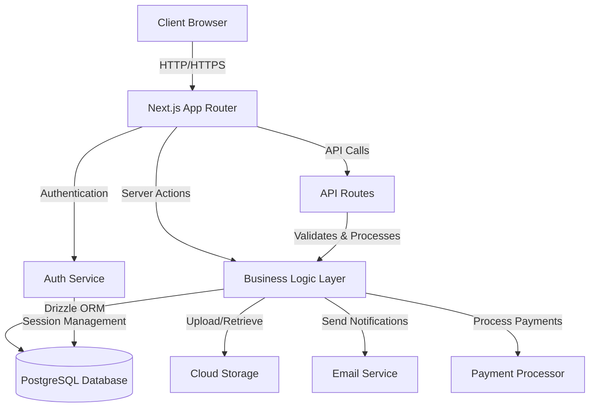
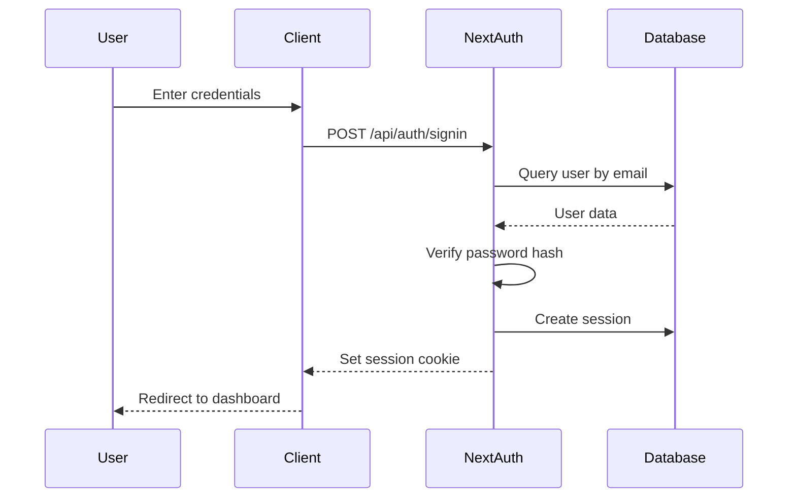

# Technical Design Document: Zivara eCommerce Platform

## Overview

Zivara is a full-stack eCommerce dropshipping platform that provides an Amazon-style shopping experience with a modern, professional design using Teal as the primary brand color. The platform is built using Next.js 14+ with the App Router, TypeScript for type safety, PostgreSQL for data persistence, and Drizzle ORM for database operations.

### System Goals

- Provide a seamless shopping experience for customers across desktop and mobile devices
- Enable efficient product catalog and order management for administrators
- Ensure data integrity and security throughout all operations
- Deliver fast page loads and responsive interactions
- Support both authenticated and guest checkout flows
- Maintain scalability to handle growing product catalogs and user bases

### Technology Stack

- **Frontend Framework**: Next.js 14+ (App Router)
- **Language**: TypeScript
- **Database**: PostgreSQL
- **ORM**: Drizzle ORM
- **Authentication**: NextAuth.js (Auth.js)
- **Styling**: Tailwind CSS with Teal (#14B8A6) as primary color
- **Image Storage**: Cloud storage (AWS S3 or similar)
- **Email Service**: Resend or similar transactional email service
- **Payment Processing**: Stripe
- **State Management**: React Context + Server Components
- **Form Validation**: Zod
- **Testing**: Vitest (unit/property tests), Playwright (E2E)

### Architecture Principles

1. **Server-First Architecture**: Leverage Next.js Server Components for data fetching and rendering
2. **Type Safety**: Use TypeScript and Zod schemas throughout the application
3. **Separation of Concerns**: Clear boundaries between UI, business logic, and data access layers
4. **Progressive Enhancement**: Core functionality works without JavaScript
5. **Security by Default**: Input validation, CSRF protection, rate limiting, and secure authentication
6. **Performance Optimization**: Caching, pagination, lazy loading, and optimized images

## Architecture

### High-Level Architecture



### Application Layers

#### 1. Presentation Layer (UI Components)
- **Location**: `src/components/` and `src/app/`
- **Responsibility**: Render UI, handle user interactions, display data
- **Technologies**: React Server Components, Client Components, Tailwind CSS

#### 2. Business Logic Layer
- **Location**: `src/features/` and `src/services/`
- **Responsibility**: Implement business rules, orchestrate operations, validate data
- **Technologies**: TypeScript, Zod validation

#### 3. Data Access Layer
- **Location**: `src/db/`
- **Responsibility**: Database queries, schema definitions, migrations
- **Technologies**: Drizzle ORM, PostgreSQL

#### 4. Integration Layer
- **Location**: `src/lib/` and `src/services/`
- **Responsibility**: External service integrations (email, payment, storage)
- **Technologies**: Service-specific SDKs

### Request Flow Patterns

#### Server Component Data Fetching
```
User Request → Next.js Server Component → Service Layer → Drizzle ORM → PostgreSQL → Response
```

#### Client Interaction with Server Actions
```
User Action → Client Component → Server Action → Service Layer → Database → Response → UI Update
```

#### API Route Pattern
```
External Request → API Route → Validation → Service Layer → Database → JSON Response
```

## Components and Interfaces

### Folder Structure

```
src/
├── app/                          # Next.js App Router pages
│   ├── (auth)/                   # Auth-related routes
│   │   ├── login/
│   │   ├── register/
│   │   └── reset-password/
│   ├── (shop)/                   # Customer-facing routes
│   │   ├── page.tsx              # Homepage
│   │   ├── products/
│   │   │   ├── page.tsx          # Product listing
│   │   │   ├── [id]/page.tsx    # Product detail
│   │   │   └── category/[slug]/page.tsx
│   │   ├── cart/
│   │   ├── checkout/
│   │   ├── orders/
│   │   │   ├── page.tsx          # Order history
│   │   │   └── [id]/page.tsx    # Order detail
│   │   └── profile/
│   ├── (admin)/                  # Admin routes
│   │   └── admin/
│   │       ├── dashboard/
│   │       ├── products/
│   │       ├── orders/
│   │       ├── users/
│   │       └── categories/
│   ├── api/                      # API routes
│   │   ├── auth/
│   │   ├── products/
│   │   ├── orders/
│   │   ├── cart/
│   │   └── webhooks/
│   ├── layout.tsx                # Root layout
│   └── globals.css
├── components/                   # Reusable UI components
│   ├── ui/                       # Base UI components
│   │   ├── button.tsx
│   │   ├── input.tsx
│   │   ├── card.tsx
│   │   ├── dialog.tsx
│   │   └── ...
│   ├── layout/                   # Layout components
│   │   ├── header.tsx
│   │   ├── footer.tsx
│   │   ├── sidebar.tsx
│   │   └── navigation.tsx
│   ├── product/                  # Product-related components
│   │   ├── product-card.tsx
│   │   ├── product-grid.tsx
│   │   ├── product-image-gallery.tsx
│   │   └── product-filters.tsx
│   ├── cart/                     # Cart components
│   │   ├── cart-item.tsx
│   │   ├── cart-summary.tsx
│   │   └── cart-drawer.tsx
│   └── order/                    # Order components
│       ├── order-card.tsx
│       ├── order-status.tsx
│       └── order-timeline.tsx
├── features/                     # Feature-specific business logic
│   ├── auth/
│   │   ├── actions.ts            # Server actions
│   │   ├── schemas.ts            # Zod validation schemas
│   │   └── utils.ts
│   ├── products/
│   │   ├── actions.ts
│   │   ├── queries.ts
│   │   ├── schemas.ts
│   │   └── utils.ts
│   ├── cart/
│   ├── orders/
│   ├── reviews/
│   └── admin/
├── db/                           # Database layer
│   ├── schema.ts                 # Drizzle schema definitions
│   ├── index.ts                  # Database connection
│   ├── migrations/               # Migration files
│   └── seed.ts                   # Seed data
├── lib/                          # Shared utilities
│   ├── auth.ts                   # Auth configuration
│   ├── email.ts                  # Email service
│   ├── storage.ts                # File storage
│   ├── payment.ts                # Payment processing
│   ├── utils.ts                  # General utilities
│   └── constants.ts
├── services/                     # External service integrations
│   ├── email-service.ts
│   ├── payment-service.ts
│   └── storage-service.ts
├── types/                        # TypeScript type definitions
│   ├── index.ts
│   ├── product.ts
│   ├── order.ts
│   └── user.ts
├── config/                       # Configuration files
│   ├── site.ts                   # Site configuration
│   └── env.ts                    # Environment variables
└── middleware.ts                 # Next.js middleware
```

### Key Component Interfaces

#### Product Components

```typescript
// components/product/product-card.tsx
interface ProductCardProps {
  product: {
    id: string;
    name: string;
    price: number;
    imageUrl: string;
    rating: number;
    reviewCount: number;
  };
  variant?: 'grid' | 'list';
}

// components/product/product-filters.tsx
interface ProductFiltersProps {
  categories: Category[];
  priceRange: { min: number; max: number };
  onFilterChange: (filters: ProductFilters) => void;
}

// components/product/product-image-gallery.tsx
interface ProductImageGalleryProps {
  images: ProductImage[];
  productName: string;
}
```

#### Cart Components

```typescript
// components/cart/cart-item.tsx
interface CartItemProps {
  item: {
    id: string;
    product: Product;
    quantity: number;
  };
  onUpdateQuantity: (quantity: number) => void;
  onRemove: () => void;
}

// components/cart/cart-summary.tsx
interface CartSummaryProps {
  items: CartItem[];
  subtotal: number;
  tax: number;
  shipping: number;
  total: number;
}
```

#### Order Components

```typescript
// components/order/order-card.tsx
interface OrderCardProps {
  order: {
    id: string;
    orderNumber: string;
    status: OrderStatus;
    total: number;
    createdAt: Date;
    itemCount: number;
  };
}

// components/order/order-timeline.tsx
interface OrderTimelineProps {
  statusHistory: {
    status: OrderStatus;
    timestamp: Date;
  }[];
  currentStatus: OrderStatus;
}
```

### Service Layer Interfaces

```typescript
// features/products/queries.ts
export async function getProducts(params: {
  page?: number;
  limit?: number;
  categoryId?: string;
  search?: string;
  minPrice?: number;
  maxPrice?: number;
  sortBy?: 'price' | 'rating' | 'newest';
}): Promise<{ products: Product[]; total: number }>;

export async function getProductById(id: string): Promise<Product | null>;

// features/cart/actions.ts
export async function addToCart(
  productId: string,
  quantity: number
): Promise<{ success: boolean; error?: string }>;

export async function updateCartItem(
  itemId: string,
  quantity: number
): Promise<{ success: boolean; error?: string }>;

// features/orders/actions.ts
export async function createOrder(
  data: CheckoutData
): Promise<{ success: boolean; orderId?: string; error?: string }>;

export async function updateOrderStatus(
  orderId: string,
  status: OrderStatus
): Promise<{ success: boolean; error?: string }>;
```

## Data Models

### Database Schema (Drizzle ORM)

```typescript
// src/db/schema.ts
import { pgTable, text, varchar, integer, decimal, timestamp, boolean, uuid, index } from 'drizzle-orm/pg-core';
import { relations } from 'drizzle-orm';

// Users Table
export const users = pgTable('users', {
  id: uuid('id').defaultRandom().primaryKey(),
  email: varchar('email', { length: 255 }).notNull().unique(),
  passwordHash: text('password_hash').notNull(),
  name: varchar('name', { length: 255 }).notNull(),
  role: varchar('role', { length: 50 }).notNull().default('customer'), // 'customer' | 'admin'
  isActive: boolean('is_active').notNull().default(true),
  createdAt: timestamp('created_at').notNull().defaultNow(),
  updatedAt: timestamp('updated_at').notNull().defaultNow(),
}, (table) => ({
  emailIdx: index('users_email_idx').on(table.email),
}));

// Categories Table
export const categories = pgTable('categories', {
  id: uuid('id').defaultRandom().primaryKey(),
  name: varchar('name', { length: 255 }).notNull(),
  slug: varchar('slug', { length: 255 }).notNull().unique(),
  parentId: uuid('parent_id'),
  description: text('description'),
  imageUrl: text('image_url'),
  displayOrder: integer('display_order').notNull().default(0),
  createdAt: timestamp('created_at').notNull().defaultNow(),
  updatedAt: timestamp('updated_at').notNull().defaultNow(),
}, (table) => ({
  slugIdx: index('categories_slug_idx').on(table.slug),
  parentIdx: index('categories_parent_idx').on(table.parentId),
}));

// Products Table
export const products = pgTable('products', {
  id: uuid('id').defaultRandom().primaryKey(),
  name: varchar('name', { length: 255 }).notNull(),
  slug: varchar('slug', { length: 255 }).notNull().unique(),
  description: text('description').notNull(),
  price: decimal('price', { precision: 10, scale: 2 }).notNull(),
  discountPrice: decimal('discount_price', { precision: 10, scale: 2 }),
  discountStartDate: timestamp('discount_start_date'),
  discountEndDate: timestamp('discount_end_date'),
  categoryId: uuid('category_id').notNull().references(() => categories.id),
  sku: varchar('sku', { length: 100 }).unique(),
  isActive: boolean('is_active').notNull().default(true),
  averageRating: decimal('average_rating', { precision: 3, scale: 2 }).default('0'),
  reviewCount: integer('review_count').notNull().default(0),
  createdAt: timestamp('created_at').notNull().defaultNow(),
  updatedAt: timestamp('updated_at').notNull().defaultNow(),
}, (table) => ({
  nameIdx: index('products_name_idx').on(table.name),
  slugIdx: index('products_slug_idx').on(table.slug),
  categoryIdx: index('products_category_idx').on(table.categoryId),
  skuIdx: index('products_sku_idx').on(table.sku),
}));

// Product Images Table
export const productImages = pgTable('product_images', {
  id: uuid('id').defaultRandom().primaryKey(),
  productId: uuid('product_id').notNull().references(() => products.id, { onDelete: 'cascade' }),
  imageUrl: text('image_url').notNull(),
  thumbnailUrl: text('thumbnail_url').notNull(),
  altText: varchar('alt_text', { length: 255 }),
  displayOrder: integer('display_order').notNull().default(0),
  isPrimary: boolean('is_primary').notNull().default(false),
  createdAt: timestamp('created_at').notNull().defaultNow(),
}, (table) => ({
  productIdx: index('product_images_product_idx').on(table.productId),
}));

// Inventory Table
export const inventory = pgTable('inventory', {
  id: uuid('id').defaultRandom().primaryKey(),
  productId: uuid('product_id').notNull().references(() => products.id).unique(),
  quantity: integer('quantity').notNull().default(0),
  lowStockThreshold: integer('low_stock_threshold').notNull().default(10),
  updatedAt: timestamp('updated_at').notNull().defaultNow(),
}, (table) => ({
  productIdx: index('inventory_product_idx').on(table.productId),
}));

// Cart Items Table
export const cartItems = pgTable('cart_items', {
  id: uuid('id').defaultRandom().primaryKey(),
  userId: uuid('user_id').references(() => users.id, { onDelete: 'cascade' }),
  sessionId: varchar('session_id', { length: 255 }), // For guest carts
  productId: uuid('product_id').notNull().references(() => products.id),
  quantity: integer('quantity').notNull().default(1),
  priceAtAdd: decimal('price_at_add', { precision: 10, scale: 2 }).notNull(),
  createdAt: timestamp('created_at').notNull().defaultNow(),
  updatedAt: timestamp('updated_at').notNull().defaultNow(),
}, (table) => ({
  userIdx: index('cart_items_user_idx').on(table.userId),
  sessionIdx: index('cart_items_session_idx').on(table.sessionId),
  productIdx: index('cart_items_product_idx').on(table.productId),
}));

// Orders Table
export const orders = pgTable('orders', {
  id: uuid('id').defaultRandom().primaryKey(),
  orderNumber: varchar('order_number', { length: 50 }).notNull().unique(),
  userId: uuid('user_id').references(() => users.id),
  guestEmail: varchar('guest_email', { length: 255 }),
  status: varchar('status', { length: 50 }).notNull().default('pending'), // 'pending' | 'processing' | 'shipped' | 'delivered' | 'cancelled'
  subtotal: decimal('subtotal', { precision: 10, scale: 2 }).notNull(),
  tax: decimal('tax', { precision: 10, scale: 2 }).notNull(),
  shipping: decimal('shipping', { precision: 10, scale: 2 }).notNull(),
  total: decimal('total', { precision: 10, scale: 2 }).notNull(),
  shippingAddressLine1: varchar('shipping_address_line1', { length: 255 }).notNull(),
  shippingAddressLine2: varchar('shipping_address_line2', { length: 255 }),
  shippingCity: varchar('shipping_city', { length: 100 }).notNull(),
  shippingState: varchar('shipping_state', { length: 100 }).notNull(),
  shippingPostalCode: varchar('shipping_postal_code', { length: 20 }).notNull(),
  shippingCountry: varchar('shipping_country', { length: 100 }).notNull(),
  paymentMethod: varchar('payment_method', { length: 50 }).notNull(),
  paymentIntentId: varchar('payment_intent_id', { length: 255 }),
  lastFourDigits: varchar('last_four_digits', { length: 4 }),
  trackingNumber: varchar('tracking_number', { length: 255 }),
  carrierName: varchar('carrier_name', { length: 100 }),
  estimatedDeliveryDate: timestamp('estimated_delivery_date'),
  createdAt: timestamp('created_at').notNull().defaultNow(),
  updatedAt: timestamp('updated_at').notNull().defaultNow(),
}, (table) => ({
  orderNumberIdx: index('orders_order_number_idx').on(table.orderNumber),
  userIdx: index('orders_user_idx').on(table.userId),
  statusIdx: index('orders_status_idx').on(table.status),
  createdAtIdx: index('orders_created_at_idx').on(table.createdAt),
}));

// Order Items Table
export const orderItems = pgTable('order_items', {
  id: uuid('id').defaultRandom().primaryKey(),
  orderId: uuid('order_id').notNull().references(() => orders.id, { onDelete: 'cascade' }),
  productId: uuid('product_id').notNull().references(() => products.id),
  productName: varchar('product_name', { length: 255 }).notNull(), // Snapshot at purchase time
  quantity: integer('quantity').notNull(),
  priceAtPurchase: decimal('price_at_purchase', { precision: 10, scale: 2 }).notNull(),
  subtotal: decimal('subtotal', { precision: 10, scale: 2 }).notNull(),
  createdAt: timestamp('created_at').notNull().defaultNow(),
}, (table) => ({
  orderIdx: index('order_items_order_idx').on(table.orderId),
  productIdx: index('order_items_product_idx').on(table.productId),
}));

// Order Status History Table
export const orderStatusHistory = pgTable('order_status_history', {
  id: uuid('id').defaultRandom().primaryKey(),
  orderId: uuid('order_id').notNull().references(() => orders.id, { onDelete: 'cascade' }),
  status: varchar('status', { length: 50 }).notNull(),
  notes: text('notes'),
  changedBy: uuid('changed_by').references(() => users.id),
  createdAt: timestamp('created_at').notNull().defaultNow(),
}, (table) => ({
  orderIdx: index('order_status_history_order_idx').on(table.orderId),
}));

// Reviews Table
export const reviews = pgTable('reviews', {
  id: uuid('id').defaultRandom().primaryKey(),
  userId: uuid('user_id').notNull().references(() => users.id, { onDelete: 'cascade' }),
  productId: uuid('product_id').notNull().references(() => products.id, { onDelete: 'cascade' }),
  rating: integer('rating').notNull(), // 1-5
  comment: text('comment').notNull(),
  helpfulCount: integer('helpful_count').notNull().default(0),
  isVerifiedPurchase: boolean('is_verified_purchase').notNull().default(false),
  createdAt: timestamp('created_at').notNull().defaultNow(),
  updatedAt: timestamp('updated_at').notNull().defaultNow(),
}, (table) => ({
  userProductIdx: index('reviews_user_product_idx').on(table.userId, table.productId),
  productIdx: index('reviews_product_idx').on(table.productId),
}));

// User Addresses Table
export const userAddresses = pgTable('user_addresses', {
  id: uuid('id').defaultRandom().primaryKey(),
  userId: uuid('user_id').notNull().references(() => users.id, { onDelete: 'cascade' }),
  label: varchar('label', { length: 100 }), // e.g., 'Home', 'Work'
  addressLine1: varchar('address_line1', { length: 255 }).notNull(),
  addressLine2: varchar('address_line2', { length: 255 }),
  city: varchar('city', { length: 100 }).notNull(),
  state: varchar('state', { length: 100 }).notNull(),
  postalCode: varchar('postal_code', { length: 20 }).notNull(),
  country: varchar('country', { length: 100 }).notNull(),
  isDefault: boolean('is_default').notNull().default(false),
  createdAt: timestamp('created_at').notNull().defaultNow(),
  updatedAt: timestamp('updated_at').notNull().defaultNow(),
}, (table) => ({
  userIdx: index('user_addresses_user_idx').on(table.userId),
}));

// Price History Table (for tracking price changes)
export const priceHistory = pgTable('price_history', {
  id: uuid('id').defaultRandom().primaryKey(),
  productId: uuid('product_id').notNull().references(() => products.id, { onDelete: 'cascade' }),
  price: decimal('price', { precision: 10, scale: 2 }).notNull(),
  effectiveDate: timestamp('effective_date').notNull().defaultNow(),
  createdAt: timestamp('created_at').notNull().defaultNow(),
}, (table) => ({
  productIdx: index('price_history_product_idx').on(table.productId),
}));

// Sessions Table (for rate limiting and tracking)
export const sessions = pgTable('sessions', {
  id: uuid('id').defaultRandom().primaryKey(),
  userId: uuid('user_id').references(() => users.id, { onDelete: 'cascade' }),
  token: text('token').notNull().unique(),
  expiresAt: timestamp('expires_at').notNull(),
  createdAt: timestamp('created_at').notNull().defaultNow(),
}, (table) => ({
  tokenIdx: index('sessions_token_idx').on(table.token),
  userIdx: index('sessions_user_idx').on(table.userId),
}));

// Audit Logs Table
export const auditLogs = pgTable('audit_logs', {
  id: uuid('id').defaultRandom().primaryKey(),
  userId: uuid('user_id').references(() => users.id),
  action: varchar('action', { length: 100 }).notNull(),
  entityType: varchar('entity_type', { length: 100 }).notNull(),
  entityId: uuid('entity_id'),
  changes: text('changes'), // JSON string of changes
  ipAddress: varchar('ip_address', { length: 45 }),
  userAgent: text('user_agent'),
  createdAt: timestamp('created_at').notNull().defaultNow(),
}, (table) => ({
  userIdx: index('audit_logs_user_idx').on(table.userId),
  entityIdx: index('audit_logs_entity_idx').on(table.entityType, table.entityId),
  createdAtIdx: index('audit_logs_created_at_idx').on(table.createdAt),
}));
```

### Drizzle Relations

```typescript
// Define relationships between tables
export const usersRelations = relations(users, ({ many }) => ({
  cartItems: many(cartItems),
  orders: many(orders),
  reviews: many(reviews),
  addresses: many(userAddresses),
}));

export const categoriesRelations = relations(categories, ({ one, many }) => ({
  parent: one(categories, {
    fields: [categories.parentId],
    references: [categories.id],
  }),
  children: many(categories),
  products: many(products),
}));

export const productsRelations = relations(products, ({ one, many }) => ({
  category: one(categories, {
    fields: [products.categoryId],
    references: [categories.id],
  }),
  images: many(productImages),
  inventory: one(inventory),
  cartItems: many(cartItems),
  orderItems: many(orderItems),
  reviews: many(reviews),
  priceHistory: many(priceHistory),
}));

export const ordersRelations = relations(orders, ({ one, many }) => ({
  user: one(users, {
    fields: [orders.userId],
    references: [users.id],
  }),
  items: many(orderItems),
  statusHistory: many(orderStatusHistory),
}));

export const reviewsRelations = relations(reviews, ({ one }) => ({
  user: one(users, {
    fields: [reviews.userId],
    references: [users.id],
  }),
  product: one(products, {
    fields: [reviews.productId],
    references: [products.id],
  }),
}));
```

### TypeScript Types

```typescript
// src/types/index.ts
import { InferSelectModel, InferInsertModel } from 'drizzle-orm';
import * as schema from '@/db/schema';

// Inferred types from schema
export type User = InferSelectModel<typeof schema.users>;
export type NewUser = InferInsertModel<typeof schema.users>;

export type Product = InferSelectModel<typeof schema.products>;
export type NewProduct = InferInsertModel<typeof schema.products>;

export type Category = InferSelectModel<typeof schema.categories>;
export type NewCategory = InferInsertModel<typeof schema.categories>;

export type Order = InferSelectModel<typeof schema.orders>;
export type NewOrder = InferInsertModel<typeof schema.orders>;

export type OrderItem = InferSelectModel<typeof schema.orderItems>;
export type Review = InferSelectModel<typeof schema.reviews>;
export type CartItem = InferSelectModel<typeof schema.cartItems>;

// Extended types with relations
export type ProductWithDetails = Product & {
  category: Category;
  images: ProductImage[];
  inventory: Inventory | null;
  reviews: Review[];
};

export type OrderWithDetails = Order & {
  items: (OrderItem & { product: Product })[];
  statusHistory: OrderStatusHistory[];
};

export type CartItemWithProduct = CartItem & {
  product: Product & { images: ProductImage[] };
};

// Enums
export type UserRole = 'customer' | 'admin';
export type OrderStatus = 'pending' | 'processing' | 'shipped' | 'delivered' | 'cancelled';

// Form data types
export interface CheckoutData {
  shippingAddress: {
    line1: string;
    line2?: string;
    city: string;
    state: string;
    postalCode: string;
    country: string;
  };
  paymentMethod: string;
  guestEmail?: string;
}

export interface ProductFilters {
  categoryId?: string;
  minPrice?: number;
  maxPrice?: number;
  minRating?: number;
  search?: string;
  sortBy?: 'price-asc' | 'price-desc' | 'rating' | 'newest';
}
```


## API Endpoint Design

### Authentication Endpoints

```
POST   /api/auth/register          # Create new user account
POST   /api/auth/login             # Authenticate user
POST   /api/auth/logout            # Invalidate session
POST   /api/auth/reset-password    # Request password reset
POST   /api/auth/verify-email      # Verify email address
GET    /api/auth/session           # Get current session
```

### Product Endpoints

```
GET    /api/products               # List products (with filters, pagination)
GET    /api/products/:id           # Get product details
POST   /api/products               # Create product (admin only)
PUT    /api/products/:id           # Update product (admin only)
DELETE /api/products/:id           # Delete product (admin only)
GET    /api/products/:id/reviews   # Get product reviews
POST   /api/products/:id/reviews   # Create review
```

### Category Endpoints

```
GET    /api/categories             # List all categories
GET    /api/categories/:id         # Get category details
POST   /api/categories             # Create category (admin only)
PUT    /api/categories/:id         # Update category (admin only)
DELETE /api/categories/:id         # Delete category (admin only)
```

### Cart Endpoints

```
GET    /api/cart                   # Get current cart
POST   /api/cart/items             # Add item to cart
PUT    /api/cart/items/:id         # Update cart item quantity
DELETE /api/cart/items/:id         # Remove item from cart
DELETE /api/cart                   # Clear cart
```

### Order Endpoints

```
GET    /api/orders                 # List user orders
GET    /api/orders/:id             # Get order details
POST   /api/orders                 # Create order (checkout)
PUT    /api/orders/:id/cancel      # Cancel order
GET    /api/orders/track/:number   # Track order (guest accessible)
PUT    /api/orders/:id/status      # Update order status (admin only)
```

### Admin Endpoints

```
GET    /api/admin/dashboard        # Get dashboard statistics
GET    /api/admin/users            # List all users
PUT    /api/admin/users/:id        # Update user (deactivate, etc.)
GET    /api/admin/orders           # List all orders with filters
POST   /api/admin/products/bulk    # Bulk product operations
```

### Webhook Endpoints

```
POST   /api/webhooks/stripe        # Stripe payment webhooks
```

### API Response Format

All API responses follow a consistent format:

```typescript
// Success response
{
  success: true,
  data: any,
  meta?: {
    page: number,
    limit: number,
    total: number
  }
}

// Error response
{
  success: false,
  error: {
    code: string,
    message: string,
    details?: any
  }
}
```

## Authentication and Authorization Flow

### Authentication Strategy

The platform uses NextAuth.js (Auth.js) for authentication with the following providers:

1. **Credentials Provider**: Email and password authentication
2. **Session Management**: JWT-based sessions with 24-hour expiration
3. **Password Security**: Bcrypt hashing with salt rounds of 12

### Authentication Flow



### Authorization Middleware

```typescript
// src/middleware.ts
import { withAuth } from 'next-auth/middleware';
import { NextResponse } from 'next/server';

export default withAuth(
  function middleware(req) {
    const token = req.nextauth.token;
    const isAdmin = token?.role === 'admin';
    const isAdminRoute = req.nextUrl.pathname.startsWith('/admin');
    
    // Protect admin routes
    if (isAdminRoute && !isAdmin) {
      return NextResponse.redirect(new URL('/', req.url));
    }
    
    return NextResponse.next();
  },
  {
    callbacks: {
      authorized: ({ token }) => !!token,
    },
  }
);

export const config = {
  matcher: ['/admin/:path*', '/profile/:path*', '/orders/:path*'],
};
```

### Role-Based Access Control

```typescript
// src/lib/auth.ts
import { getServerSession } from 'next-auth';
import { authOptions } from '@/app/api/auth/[...nextauth]/route';

export async function requireAuth() {
  const session = await getServerSession(authOptions);
  if (!session) {
    throw new Error('Unauthorized');
  }
  return session;
}

export async function requireAdmin() {
  const session = await requireAuth();
  if (session.user.role !== 'admin') {
    throw new Error('Forbidden: Admin access required');
  }
  return session;
}

// Usage in Server Actions
export async function deleteProduct(productId: string) {
  await requireAdmin(); // Throws if not admin
  // ... delete logic
}
```

### Session Configuration

```typescript
// src/app/api/auth/[...nextauth]/route.ts
import NextAuth, { NextAuthOptions } from 'next-auth';
import CredentialsProvider from 'next-auth/providers/credentials';
import { compare } from 'bcrypt';
import { db } from '@/db';
import { users } from '@/db/schema';
import { eq } from 'drizzle-orm';

export const authOptions: NextAuthOptions = {
  providers: [
    CredentialsProvider({
      name: 'Credentials',
      credentials: {
        email: { label: 'Email', type: 'email' },
        password: { label: 'Password', type: 'password' },
      },
      async authorize(credentials) {
        if (!credentials?.email || !credentials?.password) {
          return null;
        }

        const user = await db.query.users.findFirst({
          where: eq(users.email, credentials.email),
        });

        if (!user || !user.isActive) {
          return null;
        }

        const isValidPassword = await compare(
          credentials.password,
          user.passwordHash
        );

        if (!isValidPassword) {
          return null;
        }

        return {
          id: user.id,
          email: user.email,
          name: user.name,
          role: user.role,
        };
      },
    }),
  ],
  session: {
    strategy: 'jwt',
    maxAge: 24 * 60 * 60, // 24 hours
  },
  callbacks: {
    async jwt({ token, user }) {
      if (user) {
        token.role = user.role;
        token.id = user.id;
      }
      return token;
    },
    async session({ session, token }) {
      if (session.user) {
        session.user.role = token.role as string;
        session.user.id = token.id as string;
      }
      return session;
    },
  },
  pages: {
    signIn: '/login',
    error: '/login',
  },
};

const handler = NextAuth(authOptions);
export { handler as GET, handler as POST };
```

## State Management Approach

### Server State (Primary)

The platform leverages Next.js Server Components and Server Actions for most state management:

1. **Server Components**: Fetch data directly in components
2. **Server Actions**: Handle mutations and form submissions
3. **Revalidation**: Use `revalidatePath` and `revalidateTag` for cache invalidation

```typescript
// Example: Product listing page
// src/app/(shop)/products/page.tsx
import { getProducts } from '@/features/products/queries';

export default async function ProductsPage({
  searchParams,
}: {
  searchParams: { page?: string; category?: string };
}) {
  const page = Number(searchParams.page) || 1;
  const { products, total } = await getProducts({
    page,
    limit: 24,
    categoryId: searchParams.category,
  });

  return (
    <div>
      <ProductGrid products={products} />
      <Pagination page={page} total={total} />
    </div>
  );
}
```

### Client State (Minimal)

Client-side state is used only when necessary:

1. **UI State**: Modal open/close, form validation, loading states
2. **Optimistic Updates**: Cart operations, like/unlike
3. **Real-time Features**: Search suggestions, filters

```typescript
// Example: Cart drawer with optimistic updates
'use client';

import { useState, useTransition } from 'react';
import { removeFromCart } from '@/features/cart/actions';

export function CartDrawer({ items }: { items: CartItem[] }) {
  const [isPending, startTransition] = useTransition();
  const [optimisticItems, setOptimisticItems] = useState(items);

  const handleRemove = (itemId: string) => {
    // Optimistic update
    setOptimisticItems(prev => prev.filter(item => item.id !== itemId));
    
    // Server action
    startTransition(async () => {
      const result = await removeFromCart(itemId);
      if (!result.success) {
        // Revert on error
        setOptimisticItems(items);
      }
    });
  };

  return (
    <div>
      {optimisticItems.map(item => (
        <CartItem key={item.id} item={item} onRemove={handleRemove} />
      ))}
    </div>
  );
}
```

### Context for Global UI State

```typescript
// src/components/providers/cart-provider.tsx
'use client';

import { createContext, useContext, useState } from 'react';

interface CartContextType {
  isOpen: boolean;
  openCart: () => void;
  closeCart: () => void;
}

const CartContext = createContext<CartContextType | undefined>(undefined);

export function CartProvider({ children }: { children: React.ReactNode }) {
  const [isOpen, setIsOpen] = useState(false);

  return (
    <CartContext.Provider
      value={{
        isOpen,
        openCart: () => setIsOpen(true),
        closeCart: () => setIsOpen(false),
      }}
    >
      {children}
    </CartContext.Provider>
  );
}

export const useCart = () => {
  const context = useContext(CartContext);
  if (!context) throw new Error('useCart must be used within CartProvider');
  return context;
};
```

### Caching Strategy

```typescript
// src/features/products/queries.ts
import { unstable_cache } from 'next/cache';
import { db } from '@/db';

export const getProducts = unstable_cache(
  async (params: ProductQueryParams) => {
    // Database query
    return await db.query.products.findMany({
      // ... query logic
    });
  },
  ['products'],
  {
    revalidate: 300, // 5 minutes
    tags: ['products'],
  }
);

// Invalidate cache after mutations
import { revalidateTag } from 'next/cache';

export async function createProduct(data: NewProduct) {
  await db.insert(products).values(data);
  revalidateTag('products');
}
```

## Error Handling

### Error Hierarchy

```typescript
// src/lib/errors.ts
export class AppError extends Error {
  constructor(
    public code: string,
    message: string,
    public statusCode: number = 500,
    public details?: any
  ) {
    super(message);
    this.name = 'AppError';
  }
}

export class ValidationError extends AppError {
  constructor(message: string, details?: any) {
    super('VALIDATION_ERROR', message, 400, details);
    this.name = 'ValidationError';
  }
}

export class AuthenticationError extends AppError {
  constructor(message: string = 'Authentication required') {
    super('AUTHENTICATION_ERROR', message, 401);
    this.name = 'AuthenticationError';
  }
}

export class AuthorizationError extends AppError {
  constructor(message: string = 'Insufficient permissions') {
    super('AUTHORIZATION_ERROR', message, 403);
    this.name = 'AuthorizationError';
  }
}

export class NotFoundError extends AppError {
  constructor(resource: string) {
    super('NOT_FOUND', `${resource} not found`, 404);
    this.name = 'NotFoundError';
  }
}

export class ConflictError extends AppError {
  constructor(message: string) {
    super('CONFLICT', message, 409);
    this.name = 'ConflictError';
  }
}
```

### Global Error Handler

```typescript
// src/lib/error-handler.ts
import { AppError } from './errors';
import { logger } from './logger';

export function handleError(error: unknown) {
  if (error instanceof AppError) {
    logger.warn({
      code: error.code,
      message: error.message,
      statusCode: error.statusCode,
      details: error.details,
    });
    
    return {
      success: false,
      error: {
        code: error.code,
        message: error.message,
        details: error.details,
      },
    };
  }

  // Unexpected errors
  logger.error({
    message: error instanceof Error ? error.message : 'Unknown error',
    stack: error instanceof Error ? error.stack : undefined,
  });

  return {
    success: false,
    error: {
      code: 'INTERNAL_ERROR',
      message: 'An unexpected error occurred',
    },
  };
}
```

### Server Action Error Handling

```typescript
// src/features/products/actions.ts
'use server';

import { revalidatePath } from 'next/cache';
import { db } from '@/db';
import { products } from '@/db/schema';
import { productSchema } from './schemas';
import { ValidationError, AuthorizationError } from '@/lib/errors';
import { handleError } from '@/lib/error-handler';
import { requireAdmin } from '@/lib/auth';

export async function createProduct(formData: FormData) {
  try {
    // Authorization check
    await requireAdmin();

    // Validation
    const data = productSchema.parse({
      name: formData.get('name'),
      description: formData.get('description'),
      price: formData.get('price'),
      categoryId: formData.get('categoryId'),
    });

    // Business logic
    const [product] = await db.insert(products).values(data).returning();

    // Cache invalidation
    revalidatePath('/admin/products');
    revalidatePath('/products');

    return { success: true, data: product };
  } catch (error) {
    return handleError(error);
  }
}
```

### API Route Error Handling

```typescript
// src/app/api/products/route.ts
import { NextRequest, NextResponse } from 'next/server';
import { getProducts } from '@/features/products/queries';
import { handleError } from '@/lib/error-handler';

export async function GET(request: NextRequest) {
  try {
    const searchParams = request.nextUrl.searchParams;
    const page = Number(searchParams.get('page')) || 1;
    const limit = Number(searchParams.get('limit')) || 24;

    const result = await getProducts({ page, limit });

    return NextResponse.json({
      success: true,
      data: result.products,
      meta: {
        page,
        limit,
        total: result.total,
      },
    });
  } catch (error) {
    const errorResponse = handleError(error);
    const statusCode = error instanceof AppError ? error.statusCode : 500;
    return NextResponse.json(errorResponse, { status: statusCode });
  }
}
```

### Client-Side Error Boundaries

```typescript
// src/components/error-boundary.tsx
'use client';

import { useEffect } from 'react';

export function ErrorBoundary({
  error,
  reset,
}: {
  error: Error & { digest?: string };
  reset: () => void;
}) {
  useEffect(() => {
    console.error('Error:', error);
  }, [error]);

  return (
    <div className="flex min-h-screen items-center justify-center">
      <div className="text-center">
        <h2 className="text-2xl font-bold text-gray-900">
          Something went wrong!
        </h2>
        <p className="mt-2 text-gray-600">
          We're sorry for the inconvenience. Please try again.
        </p>
        <button
          onClick={reset}
          className="mt-4 rounded-md bg-teal-600 px-4 py-2 text-white hover:bg-teal-700"
        >
          Try again
        </button>
      </div>
    </div>
  );
}
```

### Logging Strategy

```typescript
// src/lib/logger.ts
type LogLevel = 'info' | 'warn' | 'error' | 'critical';

interface LogEntry {
  level: LogLevel;
  message: string;
  timestamp: Date;
  context?: Record<string, any>;
}

class Logger {
  private log(level: LogLevel, message: string, context?: Record<string, any>) {
    const entry: LogEntry = {
      level,
      message,
      timestamp: new Date(),
      context,
    };

    // In production, send to logging service (e.g., Sentry, LogRocket)
    if (process.env.NODE_ENV === 'production') {
      // Send to external logging service
      this.sendToLoggingService(entry);
    } else {
      // Console logging in development
      console[level === 'critical' ? 'error' : level](
        `[${level.toUpperCase()}]`,
        message,
        context
      );
    }
  }

  info(message: string, context?: Record<string, any>) {
    this.log('info', message, context);
  }

  warn(message: string, context?: Record<string, any>) {
    this.log('warn', message, context);
  }

  error(message: string, context?: Record<string, any>) {
    this.log('error', message, context);
  }

  critical(message: string, context?: Record<string, any>) {
    this.log('critical', message, context);
    // Send alert to admins
    this.sendAlert(message, context);
  }

  private sendToLoggingService(entry: LogEntry) {
    // Implementation for external logging service
  }

  private sendAlert(message: string, context?: Record<string, any>) {
    // Implementation for admin alerts
  }
}

export const logger = new Logger();
```

